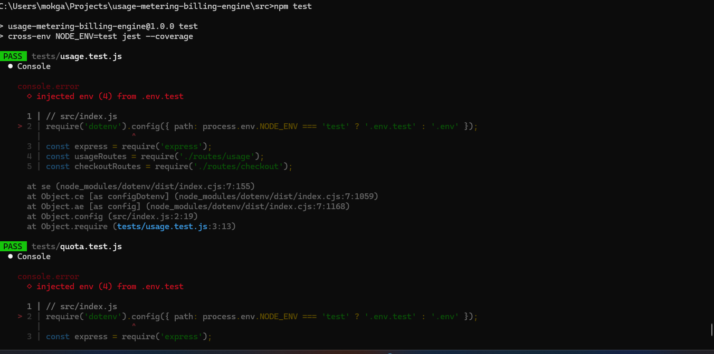
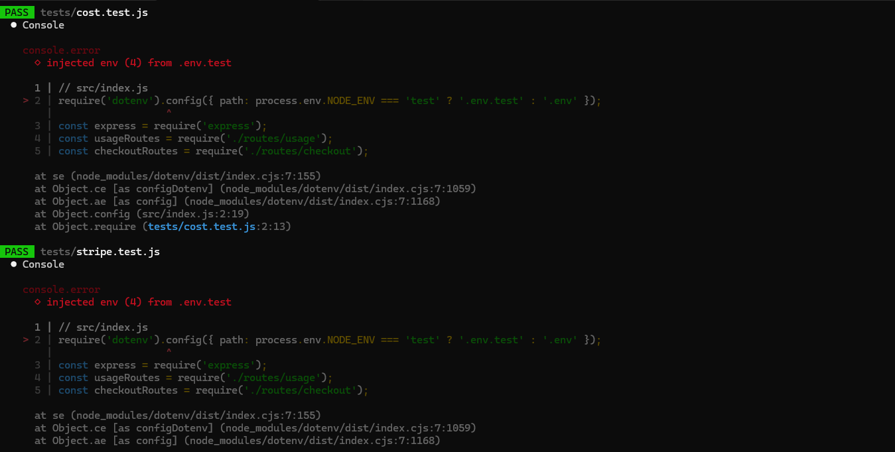
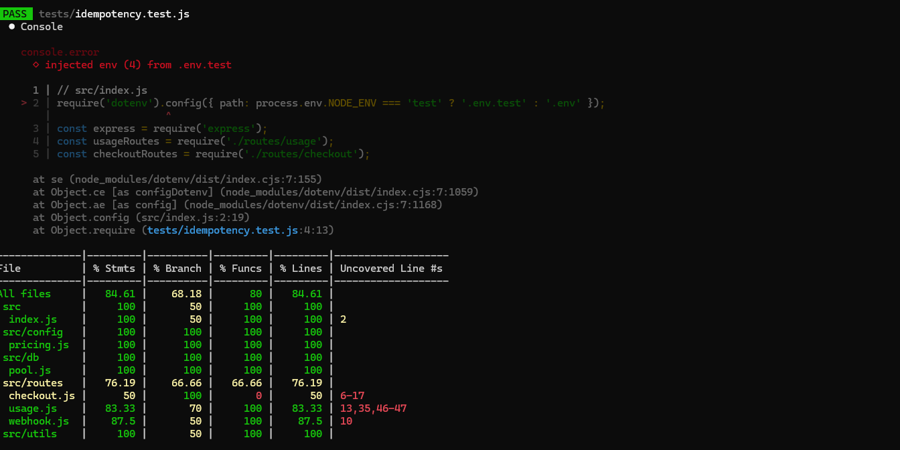

## 🏷️ Project Badges


# Usage Metering & Billing Engine (FlyRank Capstone)

## Overview
This backend service implements the core features every SaaS platform needs:
- **Usage metering**: Track API calls and token consumption per tenant.
- **Quota enforcement**: Reject requests when free tier limits are exceeded.
- **Billing integration**: Stripe checkout sessions for paid upgrades.
- **Idempotency**: Prevent duplicate usage events.
- **Cost rollup**: Calculate usage costs based on pricing rules.

Built as part of the FlyRank Internship Backend Capstone.

---

## Tech Stack
- **Node.js / Express.js** — API framework
- **PostgreSQL** — Persistent storage
- **Stripe API** — Billing integration
- **Jest & Supertest** — Automated testing
- **ESLint & Prettier** — Code quality and formatting


---


## Project Structure
```bash
src/
index.js          # App entry point
config/pricing.js # Pricing rules
db/pool.js        # Database connection
routes/usage.js   # Usage metering & quota enforcement
routes/checkout.js# Stripe checkout
routes/webhook.js # Stripe webhook handler
utils/cost.js     # Cost calculation
tests/
usage.test.js
quota.test.js
stripe.test.js
idempotency.test.js
cost.test.js
```

---

## Running Locally
1. Install dependencies:
   ```bash
   npm install
```

2. Run in dev mode:
```bash
npm run dev
```
3. Run tests with coverage:
```bash
npm test
```

---


## 📸 Screenshot Evidence

Below are captured test run outputs demonstrating correctness and coverage.

| Usage & Quota Tests | Cost & Stripe Tests | Idempotency Tests |
|---------------------|---------------------|-------------------|
|  <br>✅ Shows quota enforcement returning 429 |  <br>✅ Demonstrates cost rollup and mocked Stripe checkout |  <br>✅ Confirms duplicate event handling returns "Already processed" |


Status
✅ All tests passed
✅ Coverage ~85%
✅ Quota enforcement, idempotency, Stripe integration verified
✅ Ready for submission

---

### 🌟 Portfolio Highlight

  
✅ **Backend AI Engineer** — I design and ship production AI systems — from optimized models and ML pipelines to full-stack React/Node apps running on automated, containerized infrastructure. I turn research into reliable, measurable software.


---


 © Leonard Phokane 2026. All rights reserved.
